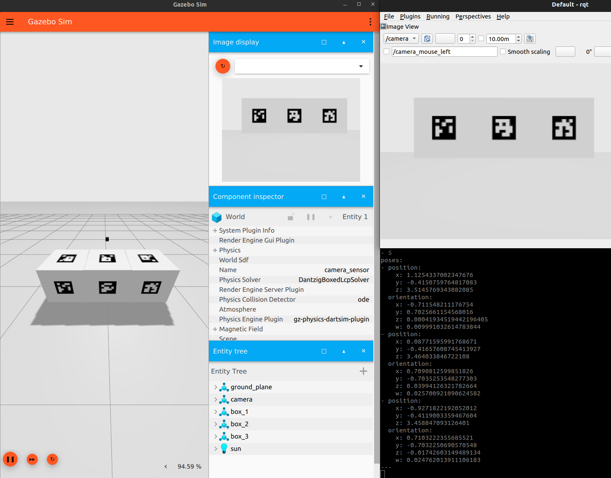

# ROS2-Gazebo-Aruco

<div style="text-align:center;">
  
</div>

This repository provides a tutorial on using an ArUco marker detector within a Gazebo simulation environment. It demonstrates how to determine the position of an ArUco marker using a camera setup in Gazebo. This guide utilizes the open-source GitHub repo [ros2_aruco](https://github.com/JMU-ROBOTICS-VIVA/ros2_aruco) as a key component.


Prerequisites
  * ROS2 Humble
  * Ubuntu 22.04
  * Python 3.10
  * Gazebo Garden


## Setup Steps
1. Clone this repo 
```
mkdir ~/gz_ros2_aruco_ws/src
cd ~/gz_ros2_aruco_ws/src
git clone https://github.com/SaxionMechatronics/ros2-gazebo-aruco.git
```
2. Clone the aruco detector ROS 2 repo:
```
cd ~/gz_ros2_aruco_ws/src
git clone https://github.com/JMU-ROBOTICS-VIVA/ros2_aruco.git
cd ros2_aruco/ros2_aruco/config
nano aruco_parameters.yaml
```
In this code, update the reference of "image_topic" from "/image_raw" to "/camera."
Also change the "marker_size" from "0.055" to "0.4"

Ctrl + O + Enter = Save

Ctrl + X         = Exit

3. After this build the repo:
```
cd ~/gz_ros2_aruco_ws
colcon build
cd
```
If this fails check the Troubleshooting section below.

4. Install the gazebo ros2 bridge
```
sudo apt-get install ros-humble-ros-gzgarden-bridge
```

5. Add this workspace to .bashrc, or you need to source it in each new terminal:
```
echo 'source ~/gz_ros2_aruco_ws/install/setup.bash' >> ~/.bashrc
```

6. Install the python library `transforms3d` 
 ```
pip3 install transforms3d
```

7. Install ROS 2 package `tf-transformations`
```
sudo apt-get install ros-humble-tf-transformations
```
8. Next, test if this works
```
urce ~/gz_ros2_aruco_ws/install/setup.bash
ros2 run ros2_aruco aruco_generate_marker
```
9. If it gives an error, do the following lines. if it gives back nothing then it works and you can skip this step.
```
pip uninstall opencv-contrib-python
pip install opencv-contrib-python==4.6.0.66
```
10. Then we can start running the world and get the detection starting.
Open the world.
```
cd ~/gz_ros2_aruco_ws/src/ros2-gazebo-aruco/gz-world
gz sim camera_and_aruco_boxes.sdf
```
This should start gazebo and run the world.

11. Start the simulation by pressing the refresh button in the right part of Gazebo and it should say "subscibed to /camera" and press play in the bottom left of Gazebo

12. Next you need to start the bridges from gazebo to ros2, both commands need to be exectuted in new different terminals.

a. Open new terminal
```
ros2 run ros_gz_bridge parameter_bridge /camera_info@sensor_msgs/msg/CameraInfo@ignition.msgs.CameraInfo
```
b. Open new terminal
```
ros2 run ros_gz_bridge parameter_bridge /camera@sensor_msgs/msg/Image@ignition.msgs.Image
```
13. Then you can start the aruco recognition, in a new terminal.
```
ros2 launch ros2_aruco aruco_recognition.launch.py
```

14. Then in another terminal you can subscribe to the /aruco_markers to find their position and their data.
```
ros2 topic echo /aruco_markers
```
# Troubleshooting
## SetuptoolsDeprecationWarning: setup.py install is deprecated.
[Run this commands](https://answers.ros.org/question/396439/setuptoolsdeprecationwarning-setuppy-install-is-deprecated-use-build-and-pip-and-other-standards-based-tools/):
```
pip install setuptools==58.2.0
```